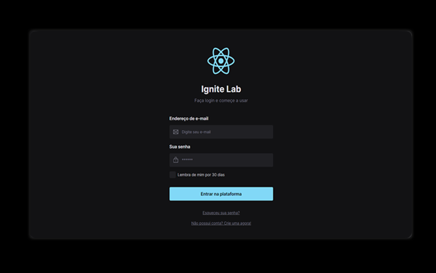

<h1 align="center"> Ignite Lab Design System</h1>

Evento exclusivo e gratuito, promovido pela Rocketseat para ensino de tecnologias WEB.

  <a href="#-tecnologias">Tecnologias</a>&nbsp;&nbsp;&nbsp;|&nbsp;&nbsp;&nbsp;
  <a href="#-projeto">Projeto</a>&nbsp;&nbsp;&nbsp;|&nbsp;&nbsp;&nbsp;
  <a href="#-layout">Layout</a>&nbsp;&nbsp;&nbsp;|&nbsp;&nbsp;&nbsp;
  <a href="#memo-licença">Licença</a>

  

 

  

## 🚀 Tecnologias

Esse projeto foi desenvolvido com as seguintes tecnologias:

- React
- Typescript e JSON
- [Node e NPM](https://nodejs.org/)
- [Vite](https://vitejs.dev/)
- [Tailwind](https://tailwindcss.com)
- [Storybook](https://storybook.js.org)

## 💻 Projeto

Esse projeto consiste em criar um Design System utilizando o [Storybook](https://johneverton01.github.io/ignite-design-system/?path=/story/components-button--default) para desenvolver os exemplos dos componentes de uma pagina de [login](https://ignite-design-system-three.vercel.app) isoladamentes.

## 🔖 Layout

Você pode visualizar o layout do projeto através [dess link](https://www.figma.com/file/8NICODZvafKQjQ14EWuVfH/Ignite-Lab-Design-System?node-id=0%3A1). É necessário ter conta no [Figma](https://figma.com) para acessá-lo.

## :memo: Licença

Esse projeto está sob a licença MIT.

---

Feito com ♥ by [John Everton](https://www.linkedin.com/in/john-everton01/) :wave:
